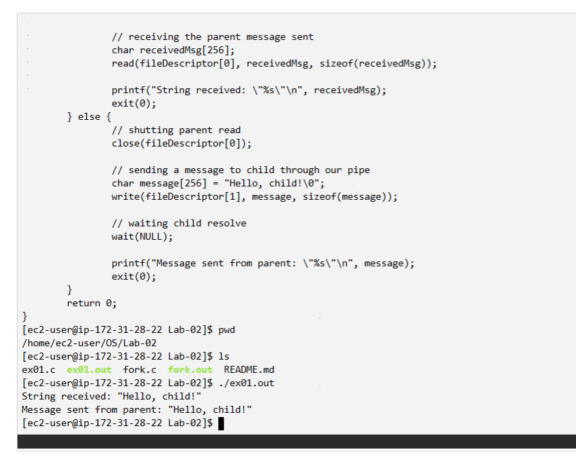

# IPC (Comunicacao entre processos)
## Como baixar a biblioteca
Um dos métodos para a comunicação entre processos pais e filhos é a utilização de pipes. Na linguagem C para a utilização de tais estruturas é 
necessário a biblioteca `unistd.h` que fornece acesso a API do sistema operacional (especificamente para o POSIX).

```c
#include <unistd.h>
```
---

## Como compilar o programa na plataforma disponibilizada:

Para compilar códigos em C, é necessário instalar o compilador gcc

> [!NOTE]
> Este comando também instala o editor de texto nano.

```bash
sudo dnf install nano gcc
```

Após a criação e edição de um arquivo `.c`, para compilar, usamos o comando

> [!NOTE]
> Além de compilar o código `.c`, precisamos definir o arquivo de saída. Usamos a extensão `.out` pelo fato dessa ser a extensão padrão gerada pelo gcc.

```bash
gcc arquivo.c -o arquivo.out
```

---

## Como executar o programa:

Para apresentar o resultado na tela, basta escrever o comando

```bash
./arquivo.out
```

---

## Comprovando a execução do programa:
A comprovação da execução do programa se dá a partir da imagem a seguir

