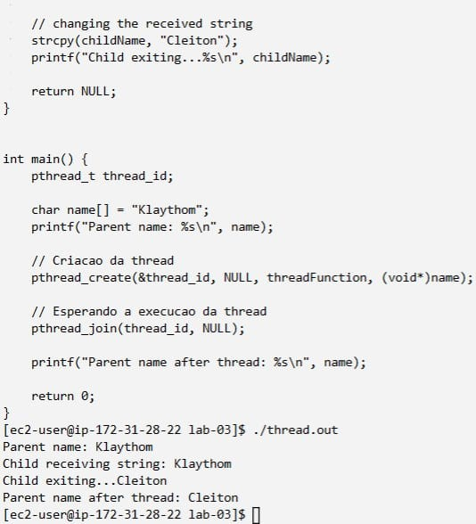

# Como compilar o programa na plataforma disponibilizada;
Para compilar o código na plataforma basta escrever o código no bash.
```bash
gcc arquivo.c -o arquivo.out -lpthread
```
---
# Como executar o programa na plataforma disponibilizada;
Para apresentar o resultado na tela, basta escrever o comando

```bash
./arquivo.out
```

---

# Como comprovar que os resultados propostos foram alcançados.

A comprovação da execução do programa se dá a partir da imagem a seguir:


