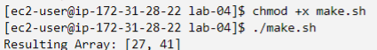

# Como compilar o programa na plataforma disponibilizada;

Para compilar o programa, basta conferir permissão para executar o arquivo `make.sh` com o seguinte comando:

```sh
chmod +x make.sh
```

---

# Como executar o programa na plataforma disponibilizada;

Para executar o programa `matrix.c`, basta executar o arquivo `make.sh` do seguinte modo:

```sh
./make.sh
```

Dentro do arquivo `make.sh`, há os seguintes comandos para executar o código em `.c`.

```sh
# Running the program
gcc matrix.c -o matrix.out -lpthread

./matrix.out

rm -if matrix.out
```

---

# Como comprovar que os resultados propostos foram alcançados.

A comprovação da execução do programa se dá a partir da imagem a seguir:


