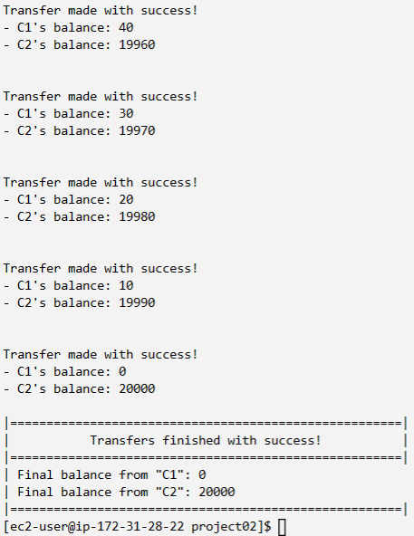

# Como compilar o programa na plataforma disponibilizada;

Para compilar o programa, basta conferir permissão para executar o arquivo `make.sh` com o seguinte comando:

```sh
chmod +x make.sh
```

# Como executar o programa na plataforma disponibilizada;

Para executar o programa `bank.c`, basta executar o arquivo `make.sh` do seguinte modo:

```sh
./make.sh
```

Dentro do arquivo `make.sh`, há os seguintes comandos para executar o código em `.c`.

```sh
gcc bank.c -o bank.out -lpthread

./bank.out

rm -if *.out
```

# Como comprovar que os resultados propostos foram alcançados.

A comprovação se dá por meio desta apresentação do resultado da compilação do programa no terminal.

